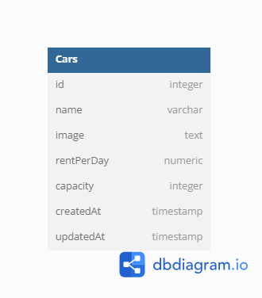

# Challenge 4 MSIB Binar Academy

## Database Structure

<p align="center" width="100%">
     
</p>

## Installation

- Clone This Repository
- `npm i`
- `npm run dev`

## Admin Dashboard

#### List Car

```http
  GET /admin/cars/list
```

Feature :

- Search Car `?search={carName}`
- Filter by capacity. `?carType={small,medium,large}` Small (less than or equal 2 seats), Medium (less than or equal 6 seats), Large (greater than 6 seats)

#### Edit page

```http
  GET /admin/cars/edit/:id
```

#### Create car

```http
  GET /admin/cars/add
```

## API Reference

#### Get all cars

```http
  GET /api/v1/cars
```

#### Get car by id

```http
  GET /api/v1/cars/:id
```

#### Create car

```http
  POST /api/v1/cars
```

#### Update car

```http
  PUT /api/v1/cars/:id
```

#### Delete car

```http
  DELETE /api/v1/cars/:id
```
