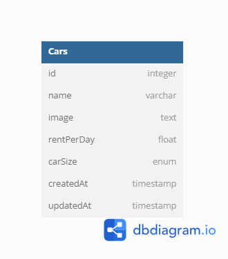

# Challenge 4 MSIB Binar Academy

## Database Structure

<!--  -->
<p align="center" width="100%">
     
</p>

## Installation

- Clone This Repository
- `npm i`
- `npm run dev`

## API Reference

#### Get all cars (Progress)

```http
  GET /api/v1/cars
```

#### Get car by id (Progress)

```http
  GET /api/v1/cars/:id
```

#### Create car (Progress)

```http
  POST /api/v1/cars
```

#### Update car (Progress)

```http
  PUT /api/v1/cars/:id
```

#### Delete car (Progress)

```http
  DELETE /api/v1/cars/:id
```
